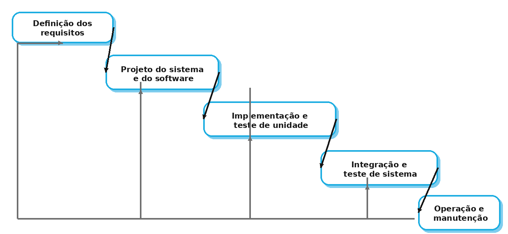
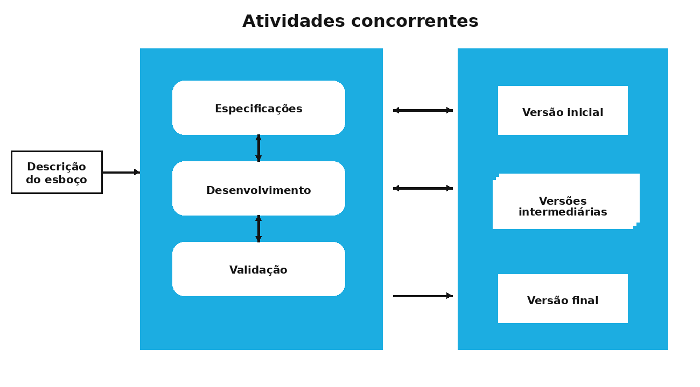
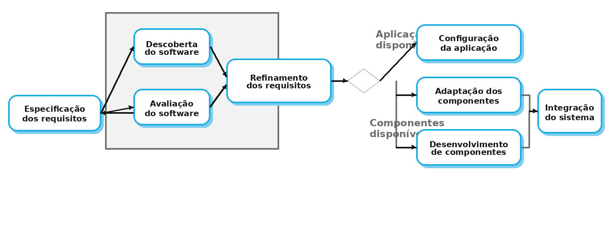

# Processos de Software

## O que são processos de software?

- **Processos de software** são conjuntos organizados de **etapas**, e cada etapa é composta por uma série de **tarefas**.
- Eles podem envolver:
  - o desenvolvimento de um sistema **a partir do zero**;
  - a **evolução** de um sistema já existente;
  - a **correção**, a **adaptação** e a **manutenção** de softwares em uso.

### Ideia central

Um processo de software ajuda a equipe a responder perguntas como:

- **O que deve ser feito primeiro?**
- **Quem será responsável por cada atividade?**
- **Quais artefatos devem ser produzidos?**
- **Como validar se o software atende ao que foi solicitado?**

> “Os processos de software são complexos e, como todos os processos intelectuais e criativos, dependem de pessoas para tomar decisões e fazer julgamentos. Não existe um processo ideal; a maioria das organizações desenvolve os próprios processos de desenvolvimento de software.”  
> **Sommerville (2018)**

---

## Atividades fundamentais de um processo de software

De forma geral, os processos de software incluem quatro grandes atividades:

- **Especificação de software**  
  Levantamento e definição do que o sistema deve fazer.

- **Projeto e implementação de software**  
  Transformação dos requisitos em uma solução técnica e depois em código.

- **Validação de software**  
  Verificação de que o sistema realmente atende ao que foi solicitado.

- **Evolução de software**  
  Alterações, melhorias e correções feitas após a entrega inicial.

### Exemplo prático

Imagine o desenvolvimento de um **sistema de biblioteca acadêmica**:

- na **especificação**, a equipe levanta requisitos como cadastro de livros, empréstimos e multas;
- no **projeto e implementação**, define banco de dados, telas e regras do sistema;
- na **validação**, testa se o aluno consegue reservar um livro corretamente;
- na **evolução**, acrescenta recursos como notificações por e-mail ou consulta por aplicativo.

---

## Modelos de processo de software

Um **modelo de processo de software** é uma representação simplificada de como o desenvolvimento acontece.

Esses modelos costumam indicar:

- as **atividades** do processo;
- os **artefatos** produzidos em cada etapa;
- os **papéis** das pessoas envolvidas;
- a **ordem** em que o trabalho acontece.

Entre os modelos mais estudados, destacam-se:

- **Waterfall (modelo em cascata)**;
- **Desenvolvimento incremental/iterativo**;
- **Integração e configuração com reuso de componentes**.

---

## Modelo Waterfall (modelo em cascata)

O modelo em cascata é um dos paradigmas mais antigos da Engenharia de Software.

- É uma abordagem **sequencial e sistemática**;
- cada fase depende da conclusão da fase anterior;
- o fluxo segue uma lógica de “cima para baixo”, como uma cascata.

### Etapas do modelo

- **Definição dos requisitos**
- **Projeto do sistema e do software**
- **Implementação e teste de unidade**
- **Integração e teste de sistema**
- **Operação e manutenção**

### Características principais

- forte ênfase em **planejamento e documentação**;
- pouca flexibilidade para mudanças ao longo do desenvolvimento;
- maior previsibilidade quando os requisitos são estáveis;
- normalmente utilizado quando há necessidade de **controle rigoroso** do processo.

### Vantagens

- organização clara das etapas;
- facilidade para documentar o projeto;
- melhor adequação a contextos com forte exigência de conformidade;
- pode funcionar bem quando os requisitos já são bem conhecidos desde o início.

### Problemas do modelo em cascata

- as empresas raramente seguem o fluxo de forma totalmente linear;
- o cliente muitas vezes **não consegue definir tudo com clareza logo no início**;
- a versão operacional do sistema normalmente só aparece **no final do projeto**;
- mudanças tardias tendem a ser **caras e difíceis**.

### Quando pode ser adequado?

Segundo a literatura, esse modelo tende a ser mais adequado quando os requisitos são fixos e possuem **baixa probabilidade de alteração**, como em:

- **sistemas embarcados**;
- **sistemas críticos**, com forte preocupação de segurança;
- **grandes sistemas de engenharia** desenvolvidos em parceria por várias equipes ou empresas.

### Exemplo

Um exemplo em que o cascata pode fazer sentido é o desenvolvimento de software para um **equipamento industrial**, em que as regras de funcionamento já foram amplamente definidas e cada alteração exige nova validação técnica e documental.

### Quando não é o mais indicado?

Não costuma ser a melhor escolha quando:

- os requisitos mudam com frequência;
- o cliente precisa ver resultados rapidamente;
- a equipe depende de feedback contínuo;
- o produto ainda está sendo descoberto ao longo do projeto.

---

## Desenvolvimento incremental

No desenvolvimento incremental, o software é construído em **partes sucessivas**.

- primeiro é criada uma **versão inicial**;
- em seguida, novas versões são produzidas;
- cada versão adiciona ou melhora funcionalidades;
- o feedback do usuário ajuda a orientar os próximos incrementos.

### Ideia central

As atividades de:

- **especificação**,
- **desenvolvimento** e
- **validação**

acontecem de forma **intercalada**, e não totalmente separadas.

### Características principais

- entrega de versões parciais do sistema;
- priorização das funcionalidades mais importantes;
- possibilidade de adaptação conforme o projeto evolui;
- aproximação maior entre equipe e cliente.

### Vantagens

- reduz o custo de mudanças nos requisitos;
- facilita o feedback constante do cliente;
- permite entrega antecipada de software útil;
- ajuda a identificar problemas mais cedo.

### Problemas do desenvolvimento incremental

Do ponto de vista da gestão, dois problemas são frequentemente apontados:

- **o processo pode se tornar menos visível**, especialmente se houver pouca documentação;
- **a estrutura do sistema pode se degradar** ao longo do tempo, caso não haja refatoração e controle arquitetural.

Também podem surgir dificuldades como:

- dependência de ferramentas específicas;
- necessidade de profissionais com experiência maior;
- risco de crescimento desorganizado em sistemas muito grandes.

### Quando utilizar?

O desenvolvimento incremental costuma ser muito útil em:

- **sistemas pequenos e médios**;
- **aplicações web**;
- **aplicativos móveis**;
- produtos em que o cliente precisa começar a usar algo antes da conclusão total do projeto.

### Exemplo

Pense em um **aplicativo de gestão escolar**:

- **versão 1:** login, consulta de notas e faltas;
- **versão 2:** avisos e calendário escolar;
- **versão 3:** comunicação com responsáveis;
- **versão 4:** painel administrativo e relatórios.

Nesse caso, a escola já pode utilizar o sistema antes da conclusão completa do produto.

### Observação importante

Adotar desenvolvimento incremental **não significa** que cada incremento precisa obrigatoriamente ser entregue ao cliente final. Em alguns casos, as versões são internas e servem para validação, demonstração ou testes.

---

## Integração e configuração

Na prática, muitos projetos não começam do zero. Em vez disso, parte da solução é montada com base em **reuso de software**.

### O que isso significa?

A equipe pode:

- descobrir softwares, bibliotecas ou serviços já existentes;
- avaliar se esses componentes atendem à necessidade do projeto;
- adaptar componentes;
- configurar aplicações prontas;
- desenvolver apenas o que estiver faltando;
- integrar tudo em um único sistema.

### Três tipos de componentes frequentemente reutilizados

- **Sistemas de aplicação stand alone**  
  Softwares já prontos, configurados para um contexto específico.

- **Componentes, bibliotecas e frameworks**  
  Partes reutilizáveis que podem ser integradas ao sistema.

- **Web services e APIs**  
  Serviços remotos acessados pela internet.

### Vantagens

- reduz a quantidade de software a ser desenvolvida;
- diminui custos e riscos;
- acelera a entrega;
- permite aproveitar soluções já testadas.

### Limitações

- nem sempre o componente reutilizado atende exatamente ao que o usuário deseja;
- pode haver dependência de terceiros;
- integrações podem ser complexas;
- concessões nos requisitos são frequentemente inevitáveis.

### Exemplo

Considere um sistema de clínica:

- autenticação com um serviço pronto;
- pagamentos por uma API externa;
- envio de mensagens por integração com outro serviço;
- desenvolvimento interno apenas do prontuário e das regras específicas do negócio.

Nesse cenário, a equipe economiza tempo, mas precisa aceitar limitações e adaptar parte dos requisitos à tecnologia disponível.

---

## Comparação entre os modelos

### Waterfall

- fluxo mais rígido;
- maior formalização;
- melhor quando os requisitos são estáveis;
- mudanças costumam ser mais caras.

### Incremental

- fluxo mais flexível;
- entregas parciais;
- melhor quando há incerteza ou necessidade de feedback;
- exige cuidado com arquitetura e organização do código.

### Integração e configuração

- foco em reuso;
- desenvolvimento mais rápido;
- menor esforço de implementação do zero;
- pode gerar dependência de componentes externos.

---

## Como escolher um processo de software?

A escolha do processo depende de fatores como:

- **estabilidade dos requisitos**;
- **tamanho e complexidade do sistema**;
- **tempo disponível**;
- **experiência da equipe**;
- **nível de risco**;
- **necessidade de documentação formal**;
- **grau de interação com o cliente**.

### Regra prática para discussão em sala

- Se os requisitos são **claros e estáveis**, o cascata pode ser considerado.
- Se os requisitos mudam com frequência, o **incremental** tende a ser mais adequado.
- Se existe muito software já disponível e reaproveitável, a **integração e configuração** pode trazer mais vantagens.

---

## Exemplos rápidos para fixação

### Exemplo 1 — Sistema para caixa eletrônico

- requisitos muito controlados;
- necessidade de segurança e validação rigorosa;
- tendência de uso de um processo mais estruturado.

### Exemplo 2 — Aplicativo de delivery local

- mudanças frequentes a partir do uso dos clientes;
- necessidade de lançar rapidamente;
- tendência de adoção de incrementos curtos.

### Exemplo 3 — Portal institucional com autenticação e mapas

- parte do sistema pode ser feita com bibliotecas prontas;
- integração com serviços externos;
- forte presença de reuso e configuração.

---

## Riscos de escolher um processo inadequado

Escolher um processo inadequado pode gerar:

- atraso nas entregas;
- dificuldade para absorver mudanças;
- aumento de custo;
- retrabalho;
- software pouco aderente à necessidade do usuário;
- excesso ou falta de documentação.

Isso mostra que **o processo não é apenas um detalhe organizacional**: ele influencia diretamente a qualidade do produto e a eficiência do trabalho da equipe.

---

## Referências básicas para a aula

- **SOMMERVILLE, Ian.** Engenharia de Software.
- **PRESSMAN, Roger S.; MAXIM, Bruce R.** Engenharia de Software: uma abordagem profissional.
