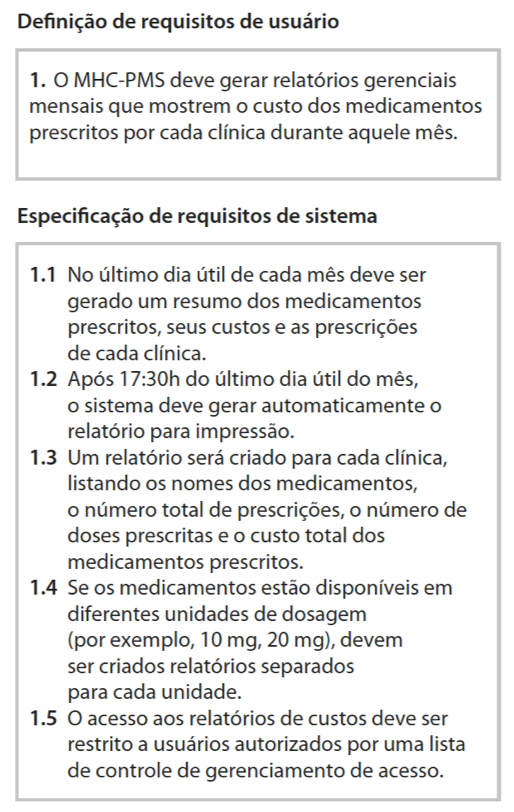
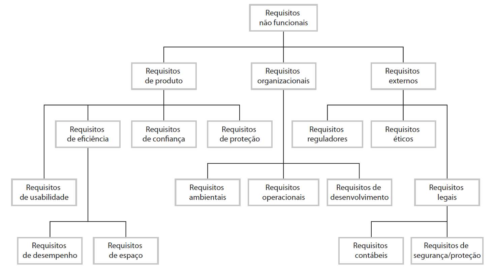

# Requisitos de Software

> **Objetivo desta aula:** Compreender a importância dos requisitos na engenharia de software e diferenciar entre requisitos funcionais e não-funcionais.

---

## Sumário

1. [O que é um Requisito?](#o-que-é-um-requisito)
2. [Engenharia de Requisitos](#engenharia-de-requisitos)
3. [Hierarquia de Requisitos](#hierarquia-de-requisitos)
4. [Requisitos Funcionais](#requisitos-funcionais)
5. [Requisitos Não-Funcionais](#requisitos-não-funcionais)
6. [Classificação dos RNF](#classificação-dos-requisitos-não-funcionais)
7. [Diferenças-Chave](#diferenças-chave)
8. [Caso Prático](#caso-prático-sistema-de-clínica)
9. [Checklist](#checklist-para-especificação-de-requisitos)

---

## O que é um Requisito?

### Definição Geral

Um **requisito** é uma **condição imprescindível** para o preenchimento de determinado objetivo. Na engenharia de software, os requisitos representam:

- **O que o sistema deve fazer**
- **Os serviços que oferece**
- **As restrições a seu funcionamento**

---

## Engenharia de Requisitos

### Conceito

A **engenharia de requisitos** é o processo de:

1. **Descobrir** - Identificar necessidades dos stakeholders
2. **Analisar** - Avaliar a viabilidade e impacto
3. **Documentar** - Registrar de forma clara e estruturada
4. **Verificar** - Validar com as partes interessadas

> **Dica:** A engenharia de requisitos é fundamental para o sucesso de qualquer projeto de software!

---

Na prática, o termo **requisito** é frequentemente utilizado de formas distintas dentro de um projeto:

- Em alguns contextos, refere-se a **declarações abstratas e genéricas** de alto nível, descrevendo o que o sistema deve fazer de forma ampla;

- Em outros, denota **especificações detalhadas e formais**, explicando precisamente como o sistema deve implementar essas funções.

Essa inconsistência na nomenclatura pode gerar confusões durante o desenvolvimento. Para resolver esse problema, **Sommerville (2018)** propõe uma **distinção clara em dois níveis**:

**1. Requisitos de Usuário (RU):** Descrições abstratas e compreensíveis para stakeholders não-técnicos, focando no que o sistema deve fazer do ponto de vista do usuário final

**2. Requisitos de Sistema (RS):** Especificações formais e detalhadas, destinadas a arquitetos e desenvolvedores, descrevendo exatamente como o sistema implementará essas funcionalidades

Essa hierarquia garante que todas as partes envolvidas no projeto (clientes, gerentes, técnicos) possam compreender e trabalhar com os requisitos em seu respectivo nível de abstração.

**Figura 1** - Hierarquia de Requisitos: Requisitos de Usuário e Requisitos de Sistema  
**Fonte:** SOMMERVILLE, I. (2018). *Engenharia de Software*. 10ª edição. Pearson.

### Públicos de Cada Tipo

| Requisitos de Usuário | Requisitos de Sistema |
|:---|:---|
| 👤 Gerentes clientes | 👥 Usuários finais do sistema |
| 👷 Engenheiros clientes | 🏗️ Arquitetos de sistema |
| 💼 Gerentes contratantes | 💻 Desenvolvedores de software |
| 🏛️ Arquitetos de sistema | |

---

## Requisitos Funcionais

### O que são?

Requisitos que **definem as funções** que o sistema deve fornecer, descrevendo:

- Como o sistema deve reagir a entradas específicas
- Como se comportar em determinadas situações
- O que **não deve fazer** (em alguns casos)

### Elementos Essenciais de um RF

Um bom requisito funcional deve conter:

1. **Descrição de uma função a ser executada pelo sistema**
   - Usualmente entrada, saída ou transformação da informação

2. **Origem do requisito**
   - Quem solicitou e/ou quem vai executar a função

3. **Informações de entrada e saída**
   - Quais dados são passados do sistema para o usuário e vice-versa

4. **Restrições aplicáveis**
   - Regras de negócio ou restrições tecnológicas

### Tipos de Funções

### Exemplos Práticos

✨ **Exemplo 1:** O sistema deve possibilitar o **cálculo das comissões** dos vendedores de acordo com os produtos vendidos

✨ **Exemplo 2:** O sistema deve **emitir relatórios** de compras e vendas por período

✨ **Exemplo 3:** O sistema deve **mostrar**, para cada aluno, as disciplinas em que foi aprovado ou reprovado

✨ **Exemplo 4:** O sistema deve **gerar**, a cada dia, para cada clínica, a lista dos pacientes para as consultas daquele dia

---

## Requisitos Não-Funcionais

### O que são?

Requisitos que **não estão diretamente relacionados** com os serviços específicos do sistema, mas especificam ou restringem suas características gerais.

### Características

| Aspecto | Descrição |
|:---|:---|
| **Escopo** | Propriedades emergentes do sistema como um todo |
| **Importância** | Frequentemente mais críticos que RFs individuais |
| **Impacto** | Deixar de atender pode inutilizar todo o sistema |
| **Origem** | Necessidades dos usuários, políticas, regulações |

### Origem dos RNF

Os requisitos não-funcionais surgem de:

- **Restrições de orçamento**
- **Políticas organizacionais**
- **Interoperabilidade** com outros sistemas
- **Legislação e regulações** (segurança, privacidade)

---

## Classificação dos Requisitos Não-Funcionais

### Segundo Sommerville (2011)

**Figura 1** - Tipos de requisitos não funcionais
**Fonte:** SOMMERVILLE, I. (2018). *Engenharia de Software*. 10ª edição. Pearson.

### 1️⃣ Requisitos de Produto

Especificam o **comportamento do produto**:

- **Usabilidade**
  - Interface intuitiva e fácil de usar
  - Requisitos de desempenho
  - Requisitos de espaço

- **Eficiência**
  - Tempo de resposta otimizado
  - Uso de memória controlado

- **Confiabilidade**
  - Disponibilidade do sistema
  - Taxa de falhas aceitável

- **Proteção**
  - Acesso restrito a usuários autorizados
  - Criptografia de dados sensíveis

### 2️⃣ Requisitos Organizacionais

Derivados de **políticas e procedimentos** da organização:

- **Requisitos Operacionais**
  - Procedimentos de uso e manutenção
  - Documentação necessária

- **Requisitos Ambientais**
  - Ambiente de operação do sistema
  - Compatibilidade com infraestrutura

- **Requisitos de Desenvolvimento**
  - Prazos definidos
  - Tecnologias aprovadas
  - Padrões de código

### 3️⃣ Requisitos Externos

Procedentes de **fatores externos** ao sistema:

- **Requisitos Reguladores**
  - Conformidade com leis e normas
  - Certificações necessárias

- **Requisitos Legais**
  - Requisitos contábeis
  - Segurança e proteção de dados

- **Requisitos Éticos**
  - Responsabilidade social
  - Impacto ambiental

---

## Exemplos de Requisitos Não-Funcionais

| Tipo | Exemplo |
|:---|:---|
| **Segurança** | O sistema deve ser protegido para acesso apenas de usuários autorizados |
| **Performance** | O tempo de resposta do sistema não deve ultrapassar 20 segundos |
| **Cronograma** | O tempo de desenvolvimento não deve ultrapassar doze meses |
| **Disponibilidade** | O sistema deve estar disponível 99,9% do tempo |
| **Compatibilidade** | O sistema deve ser compatível com navegadores modernos |
| **Escalabilidade** | O sistema deve suportar até 10.000 usuários simultâneos |
| **Manutenibilidade** | O código deve seguir padrões e ser bem documentado |

---

## Diferenças-Chave

### Comparação Completa

| Aspecto | Requisitos Funcionais | Requisitos Não-Funcionais |
|:---|:---|:---|
| **Foco** | O que o sistema faz | Como o sistema se comporta |
| **Descrição** | Funções e serviços | Propriedades e restrições |
| **Variabilidade** | Dependem do tipo de software | Aplicáveis a qualquer software |
| **Verificação** | Testável contra casos de uso | Testável contra critérios específicos |
| **Impacto da falha** | Perda de uma função específica | Sistema completamente inutilizável |
| **Documentação** | Mais fácil de documentar | Mais difícil de documentar |
| **Exemplos** | Calcular, emitir, gerar, registrar | Segurança, performance, confiabilidade |

---

## Caso Prático: Sistema de Clínica

### Requisitos de Usuário

> "O sistema deve gerenciar agendamentos de pacientes e gerar relatórios mensais de medicamentos"

### Requisitos de Sistema - Funcionais

1. O OMC-PMS deve gerar relatórios gerenciais mensais com medicamentos prescritos por cada clínica durante aquele mês

2. A cada 17:30h do último dia útil de cada mês, o sistema deve gerar um resumo dos medicamentos prescritos por cada clínica da clínica

3. Um relatório por clínica contendo nomes dos medicamentos, número de prescrições e custo total dos medicamentos prescritos

4. Os medicamentos devem estar disponíveis em cada clínica no mês quando solicitados

5. O acesso aos relatórios de custos deve ser restrito aos usuários autorizados da clínica para controle de depreciamento de acesso

### Requisitos de Sistema - Não-Funcionais

- **Segurança:** Acesso restrito por credenciais e autenticação de dois fatores
- **Performance:** Geração de relatório em no máximo 5 minutos
- **Conformidade:** Seguir LGPD e regulações de saúde (ANVISA)
- **Armazenamento:** Manter histórico de 5 anos com backup diário
- **Disponibilidade:** Sistema disponível 24/7 com redundância
- **Integridade:** Validação de dados com checksums

---

## Checklist para Especificação de Requisitos

Antes de finalizar seus requisitos, verifique:

- [ ] Cada requisito tem um identificador único?
- [ ] O requisito é **claro e sem ambiguidades**?
- [ ] O requisito é **completo** (não referencia informações ausentes)?
- [ ] O requisito é **viável** com recursos disponíveis?
- [ ] O requisito é **verificável** (testável)?
- [ ] Não há **conflitos** com outros requisitos?
- [ ] A **origem** do requisito está documentada?
- [ ] A **prioridade** foi definida (alta, média, baixa)?
- [ ] O requisito está **rastreável** para cada stakeholder?
- [ ] A linguagem é **objetiva** e sem termos vagos?

---

## Conclusão

### Pontos-Chave

1. **Requisitos são a base** de qualquer projeto de software bem-sucedido
2. **Dois tipos principais**: Funcionais (O QUÊ) e Não-Funcionais (COMO)
3. **Comunicação clara** entre stakeholders é essencial para evitar mal-entendidos
4. **Documentação adequada** evita retrabalho e conflitos durante o desenvolvimento
5. **Validação constante** garante alinhamento com expectativas dos clientes
6. **Hierarquização** permite priorização e planejamento eficaz
7. **Rastreabilidade** facilita a manutenção e evolução do software

---

## Referências

- **Sommerville, I.** (2018). *Engenharia de Software*. 10ª edição. Pearson.
- **Pressman, R. S.** (2010). *Engenharia de Software: uma abordagem profissional*. McGraw-Hill.

---
