# Modelagem de Sistemas

## Sumário

1. [Modelagem de sistemas](#1-modelagem-de-sistemas)
2. [UML — Unified Modeling Language](#2-uml--unified-modeling-language)
3. [Diagrama de casos de uso](#3-diagrama-de-casos-de-uso)
4. [Atores](#4-atores)
5. [Casos de uso](#5-casos-de-uso)
6. [Relacionamentos entre casos de uso e atores](#6-relacionamentos-entre-casos-de-uso-e-atores)
7. [Resumo dos relacionamentos](#7-resumo-dos-relacionamentos)
8. [Boas práticas e erros comuns](#8-boas-práticas-e-erros-comuns)
9. [Referências](#referências)

---

## 1. Modelagem de sistemas

**Modelagem de sistemas** é o processo de desenvolvimento de modelos abstratos de um sistema, em que cada modelo apresenta uma **visão ou perspectiva diferente** do sistema. Os modelos são representados com algum tipo de notação gráfica, quase sempre baseada na **UML** (*Unified Modeling Language*, Linguagem de Modelagem Unificada).

### 1.1 Para que servem os modelos?

- **Na engenharia de requisitos:** ajudam a extrair e validar os requisitos do sistema;
- **No projeto:** descrevem o sistema para os engenheiros que irão implementá-lo;
- **Na documentação:** registram a estrutura e a operação do sistema.

### 1.2 Modelos do sistema existente × modelos do novo sistema

| Modelos do sistema **existente** | Modelos do sistema **novo** |
|---|---|
| Usados durante a engenharia de requisitos. | Usados durante a engenharia de requisitos para explicar os requisitos propostos a outros *stakeholders*. |
| Esclarecem o que o sistema atual faz. | Permitem aos engenheiros discutir propostas de projeto. |
| Servem de ponto de partida para discutir pontos fortes e fracos. | Documentam o sistema para a implementação. |
| Levam aos requisitos do novo sistema. | Na **engenharia dirigida a modelos** (MDE), é possível gerar uma implementação completa ou parcial a partir do modelo. |

### 1.3 Modelo é abstração

O aspecto mais importante de um modelo é que ele **deixa de fora os detalhes**. Um modelo é uma **abstração** do sistema estudado, e não uma representação alternativa dele. Já uma *representação* de um sistema deveria manter todas as informações sobre a entidade representada.

> **Para pensar:** um mapa de metrô é um ótimo modelo justamente porque ignora distâncias reais, ruas e prédios — mostra apenas o que interessa para quem vai pegar o trem.

### 1.4 Perspectivas de modelagem

A partir de perspectivas diferentes, é possível desenvolver diversos modelos para o mesmo sistema:

| Perspectiva | O que modela | Exemplos de diagramas |
|---|---|---|
| **Externa** | O contexto ou ambiente do sistema | Diagrama de contexto, casos de uso |
| **De interação** | As interações entre o sistema e seu ambiente, ou entre componentes do sistema | Casos de uso, sequência, comunicação |
| **Estrutural** | A organização do sistema ou a estrutura dos dados que ele processa | Classes, componentes, implantação |
| **Comportamental** | O comportamento dinâmico do sistema e como ele reage a eventos | Atividades, máquina de estados |

---

## 2. UML — Unified Modeling Language

A **UML** é uma linguagem gráfica e notacional usada na engenharia de software para **representar, visualizar, especificar e documentar** sistemas. Ela fornece um conjunto padronizado de diagramas e símbolos que permite aos profissionais comunicar ideias, conceitos e informações sobre sistemas de forma clara.

- É mantida pelo **OMG** (*Object Management Group*);
- A versão vigente é a **UML 2.5.1**, publicada em dezembro de 2017 — continua sendo a versão oficial em 2026;
- A UML também foi padronizada internacionalmente como **ISO/IEC 19505**.

> **Atualização (2025):** em julho de 2025 o OMG aprovou a adoção final da **SysML v2**, linguagem de modelagem voltada à *engenharia de sistemas* (hardware + software). Diferente da SysML v1, que era um perfil (extensão) da UML, a SysML v2 tem metamodelo próprio e **notação textual** além da gráfica. Para desenvolvimento de software de aplicação, a UML continua sendo a referência.

### 2.1 Os 14 diagramas da UML 2.5.1

Os diagramas são divididos em duas grandes categorias: **estrutura** (o que o sistema *é*) e **comportamento** (o que o sistema *faz*).

| Diagramas de **Estrutura** (7) | Diagramas de **Comportamento** (7) |
|---|---|
| Diagrama de Classes | Diagrama de Casos de Uso |
| Diagrama de Objetos | Diagrama de Atividades |
| Diagrama de Pacotes | Diagrama de Máquina de Estados |
| Diagrama de Componentes | *Diagramas de Interação:* |
| Diagrama de Estrutura Composta | ↳ Diagrama de Sequência |
| Diagrama de Implantação | ↳ Diagrama de Comunicação |
| Diagrama de Perfil | ↳ Diagrama de Visão Geral de Interação |
| | ↳ Diagrama de Tempo |

> **Correção em relação à versão anterior dos slides:** "Diagrama de Estado" e "Diagrama de Máquina de Estados" são o **mesmo** diagrama (o nome oficial na UML 2 é *máquina de estados*). Faltavam na lista o **Diagrama de Perfil** (estrutura) e o **Diagrama de Visão Geral de Interação** (comportamento).

### 2.2 Os cinco diagramas mais usados

A pesquisa de **Erickson e Siau (2007)** mostrou que a maioria dos usuários de UML acredita que **cinco tipos de diagramas** podem representar a essência de um sistema:

1. **Casos de uso** — mostram as interações entre o sistema e seu ambiente;
2. **Sequência** — mostram as interações entre atores e sistema, e entre os componentes do sistema;
3. **Atividades** — mostram as atividades envolvidas em um processo ou no processamento de dados;
4. **Classes** — mostram as classes de objetos do sistema e as associações entre elas;
5. **Máquina de estados** — mostram como o sistema reage a eventos internos e externos.

> Na prática atual, é comum a UML ser usada de forma **"leve"** (*UML as sketch*): esboços para comunicar e discutir ideias, e não documentação exaustiva de todos os 14 diagramas.

---

## 3. Diagrama de casos de uso

O **diagrama de casos de uso** (*use case diagram*) é, dentre todos os diagramas da UML, o **mais abstrato, flexível e informal**.

- É utilizado principalmente no **início da modelagem**, a partir do documento de requisitos, e pode ser consultado e modificado durante todo o processo de engenharia;
- Seu objetivo é **modelar as funcionalidades e serviços oferecidos pelo sistema**, demonstrando, por meio de uma linguagem simples, o **comportamento externo** do sistema a partir da **perspectiva do usuário**.

### 3.1 Casos de uso e requisitos

- Há uma **correspondência entre os requisitos funcionais** e os casos de uso;
- Os **requisitos não funcionais não aparecem** no diagrama de casos de uso, pois não são o foco dessa modelagem (eles podem ser registrados na descrição textual do caso de uso ou em documento próprio);
- O diagrama é composto por **atores**, **casos de uso**, **relacionamentos** e, normalmente, pela **fronteira do sistema**.

> **Complemento — fronteira do sistema:** é o retângulo que delimita o sistema, com o nome dele no topo. Os casos de uso ficam **dentro** da fronteira; os atores ficam **fora**. Ela deixa explícito o que é responsabilidade do sistema e o que é externo a ele.

---

## 4. Atores

Um **ator** representa um **papel** que um ser humano, um dispositivo de hardware ou até mesmo outro sistema desempenha ao interagir com o sistema.

- Um ator pode ser qualquer **elemento externo** que interage com o software;
- O **nome do ator** identifica o papel assumido por ele no diagrama;
- Um caso de uso é sempre **iniciado por um estímulo de um ator**; ocasionalmente, outros atores também participam.

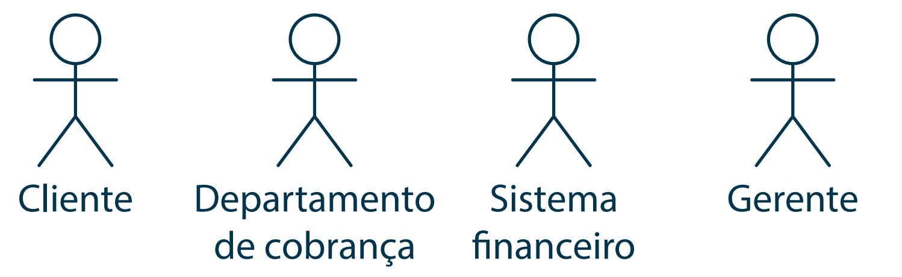

*Figura 1 — Exemplos de atores.*

> **Complemento:**
> - **Ator ≠ pessoa.** A mesma pessoa pode assumir papéis diferentes (ex.: um funcionário que também é *Cliente* da loja).
> - **Ator primário:** inicia o caso de uso para atingir um objetivo. **Ator secundário (de suporte):** presta um serviço ao sistema durante o caso de uso (ex.: *Operadora de cartão*, *Serviço de e-mail*).
> - Eventos disparados por agenda (backup diário, envio de cobranças mensais) costumam ser modelados com um ator **Tempo** ou **Agendador**.

---

## 5. Casos de uso

Um **caso de uso** especifica o comportamento de um sistema, ou de parte dele, referindo-se a **serviços, tarefas ou funções** que o sistema oferece.

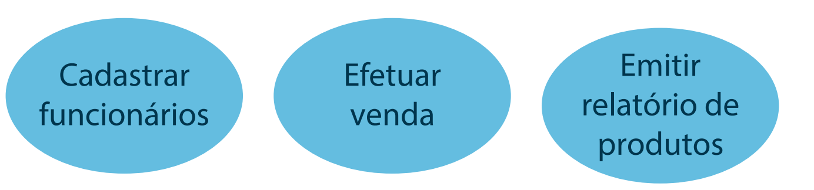

*Figura 2 — Exemplos de casos de uso.*

### 5.1 Nomeação

- Os nomes de casos de uso são **breves expressões verbais ativas** (verbo no infinitivo + complemento);
- Nomeiam algum comportamento do vocabulário do sistema, identificado a partir do documento de requisitos;
- Verbos comuns: *efetuar, cadastrar, consultar, emitir, registrar, realizar, manter, verificar*, entre outros.

> **Dica:** um bom caso de uso entrega um **resultado de valor** para o ator. "Clicar no botão Salvar" é um passo, não um caso de uso; "Cadastrar cliente" é um caso de uso.

### 5.2 Notação

Em sua forma mais simples, um caso de uso é mostrado como uma **elipse**, com os atores envolvidos representados por **figuras-palito** (*stick figures*).

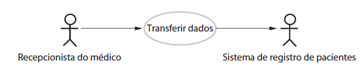

*Figura 3 — Caso de uso "Transferir dados" (Sommerville).*

### 5.3 Descrição do caso de uso

O diagrama dá apenas uma **visão simples** da interação. Para entender o que está envolvido, é necessário fornecer mais detalhes, que podem ser:

- uma **descrição textual** simples;
- uma **descrição estruturada em tabela**;
- um **diagrama de sequência**.

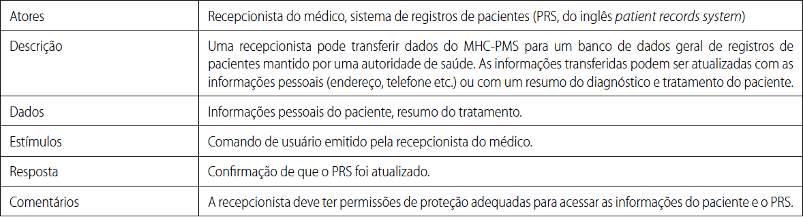

*Figura 4 — Descrição tabular do caso de uso "Transferir dados".*

#### Modelo de descrição expandida (recomendado)

O modelo abaixo, inspirado no formato de Cockburn, é o mais usado atualmente em projetos e TCCs:

| Campo | Exemplo — **Efetuar venda** |
|---|---|
| **Ator primário** | Vendedor |
| **Atores secundários** | Operadora de cartão |
| **Pré-condições** | Vendedor autenticado no sistema; caixa aberto. |
| **Fluxo principal** | 1. Vendedor inicia uma nova venda. 2. Vendedor informa os produtos e quantidades. 3. Sistema calcula o total. 4. Vendedor informa a forma de pagamento. 5. Sistema solicita autorização à operadora. 6. Sistema registra a venda e emite o comprovante. |
| **Fluxos alternativos** | 3a. Cliente especial: sistema aplica desconto (*extend* "Calcular desconto para cliente especial"). 5a. Autorização negada: sistema informa a falha e retorna ao passo 4. |
| **Pós-condições** | Venda registrada e estoque atualizado. |
| **Regras de negócio** | RN01 — Desconto máximo de 10% para cliente especial. |
| **Requisitos relacionados** | RF05, RNF02 |

---

## 6. Relacionamentos entre casos de uso e atores

Os casos de uso representam conjuntos bem definidos de funcionalidades e precisam se relacionar com outros casos de uso e com os atores que enviam e recebem mensagens deles. Os relacionamentos possíveis são **associação, generalização, inclusão e extensão**:

- **Ator ↔ caso de uso:** somente **associação**;
- **Ator ↔ ator:** somente **generalização**;
- **Caso de uso ↔ caso de uso:** **generalização, inclusão e extensão**.

### 6.1 Associação

- É o **único** relacionamento possível entre ator e caso de uso, e é sempre **binária** (envolve apenas dois elementos);
- Indica que o ator **utiliza** a funcionalidade representada pelo caso de uso (ou participa dela);
- É representada por uma **linha reta** ligando o ator ao caso de uso.

A linha pode ter uma **seta** em uma extremidade, indicando a navegabilidade:

| Situação | Notação | Figura |
|---|---|---|
| Informações fornecidas pelo ator ao caso de uso | Seta aponta para o **caso de uso** | Figura 5 |
| Informações transmitidas pelo caso de uso ao ator | Seta aponta para o **ator** | Figura 6 |
| Comunicação nos dois sentidos | Linha **sem setas** | Figura 7 |

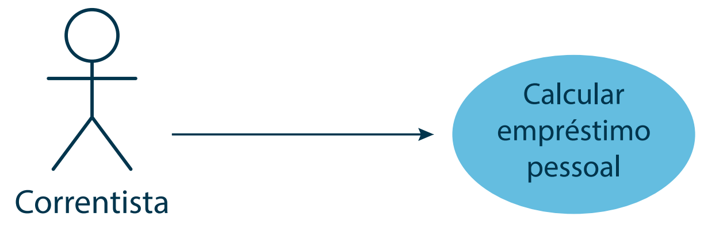

*Figura 5 — Associação: ator → caso de uso.*

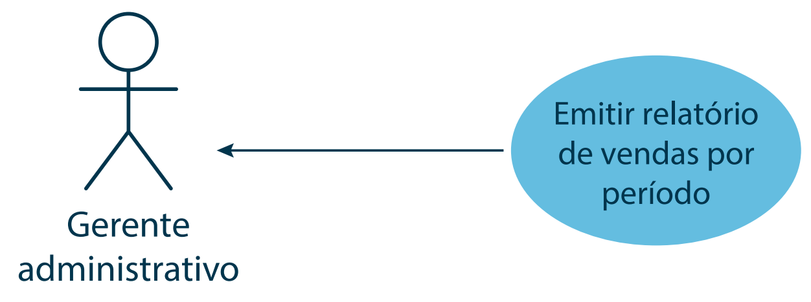

*Figura 6 — Associação: caso de uso → ator.*

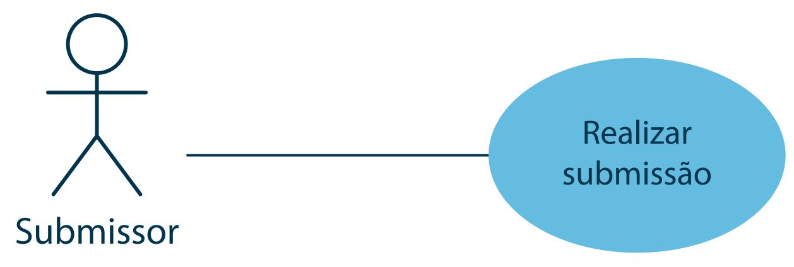

*Figura 7 — Associação sem direção (bidirecional).*

> **Atualização:** a UML 2.5.1 não atribui um significado de "fluxo de dados" às setas nas associações. Na prática atual, recomenda-se usar **linhas simples, sem setas**, e — quando útil — posicionar o **ator primário à esquerda** e os **atores secundários à direita** da fronteira do sistema. Se a equipe optar por usar setas, o significado deve ser combinado e aplicado de forma consistente.

### 6.2 Generalização

A generalização é o mesmo conceito de **herança** da orientação a objetos: um elemento **específico** herda as características de um elemento **geral**.

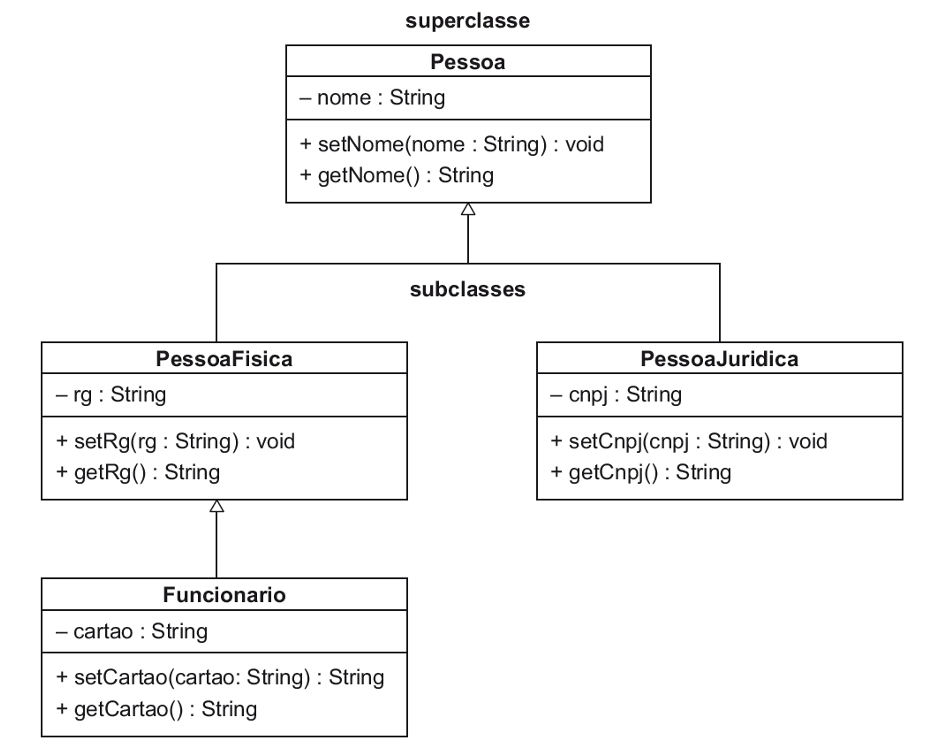

*Figura 8 — Generalização/especialização em um diagrama de classes (revisão de POO).*

> **Observação sobre a Figura 8:** o método `setCartao(cartao: String)` deveria retornar `void`, assim como os demais *setters*.

#### Generalização entre casos de uso

- Ocorre quando existem dois ou mais casos de uso com **características semelhantes** e pequenas diferenças entre si;
- Define-se um **caso de uso geral**, com as características compartilhadas;
- Os **casos de uso específicos** relacionam-se com o geral e documentam **apenas** o que têm de particular.

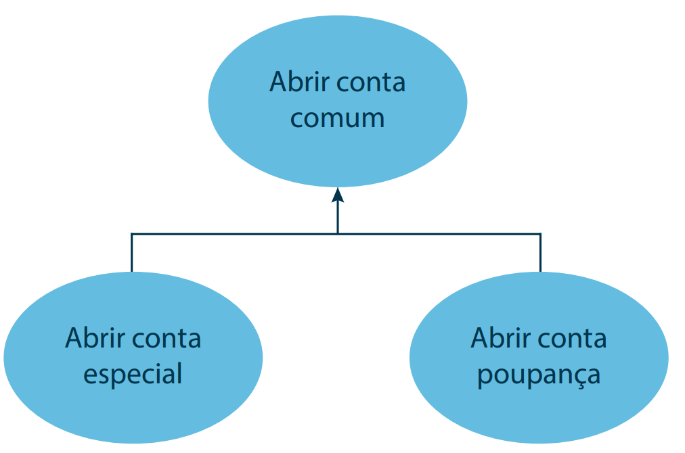

*Figura 9 — Generalização entre casos de uso.*

#### Generalização entre atores

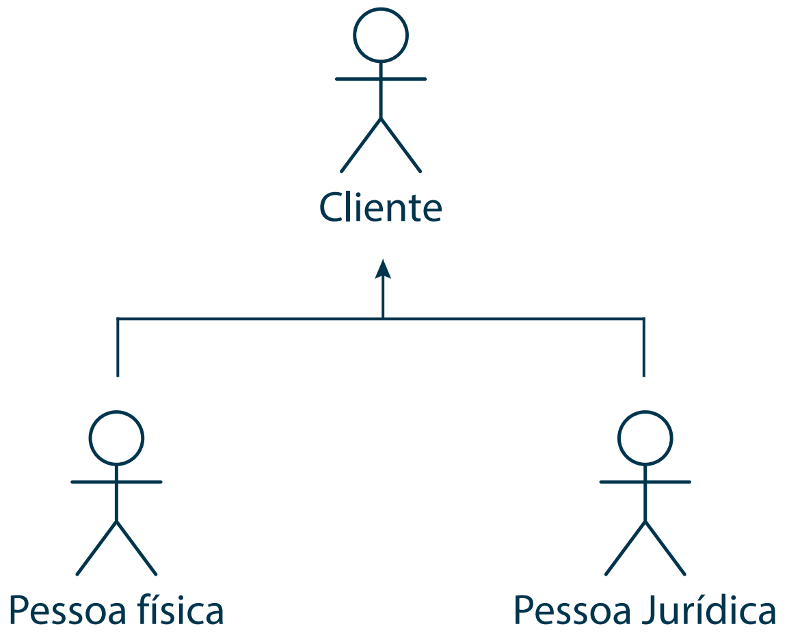

*Figura 10 — Generalização entre atores.*

> **Atenção à notação:** na UML, a generalização é representada por uma linha contínua com **ponta de triângulo vazado** (▷), apontando do elemento específico para o geral. As Figuras 9 e 10 usam uma seta simplificada; no seu diagrama, use o triângulo vazado.

### 6.3 Inclusão (`<<include>>`)

- Possível **somente entre casos de uso**;
- Utilizada quando existem **ações comuns a mais de um caso de uso**;
- Essas ações são documentadas em um caso de uso próprio, que os demais **reutilizam**, evitando descrever a mesma sequência de passos várias vezes;
- O caso de uso base **incorpora explicitamente** o comportamento do incluído — pode ser comparado a uma **chamada de sub-rotina**;
- Indica **obrigatoriedade**: a execução do caso de uso base **sempre** implica a execução do incluído.

**Notação:** linha **tracejada** com seta aberta, rotulada com `<<include>>`. A seta **aponta para o caso de uso incluído**.

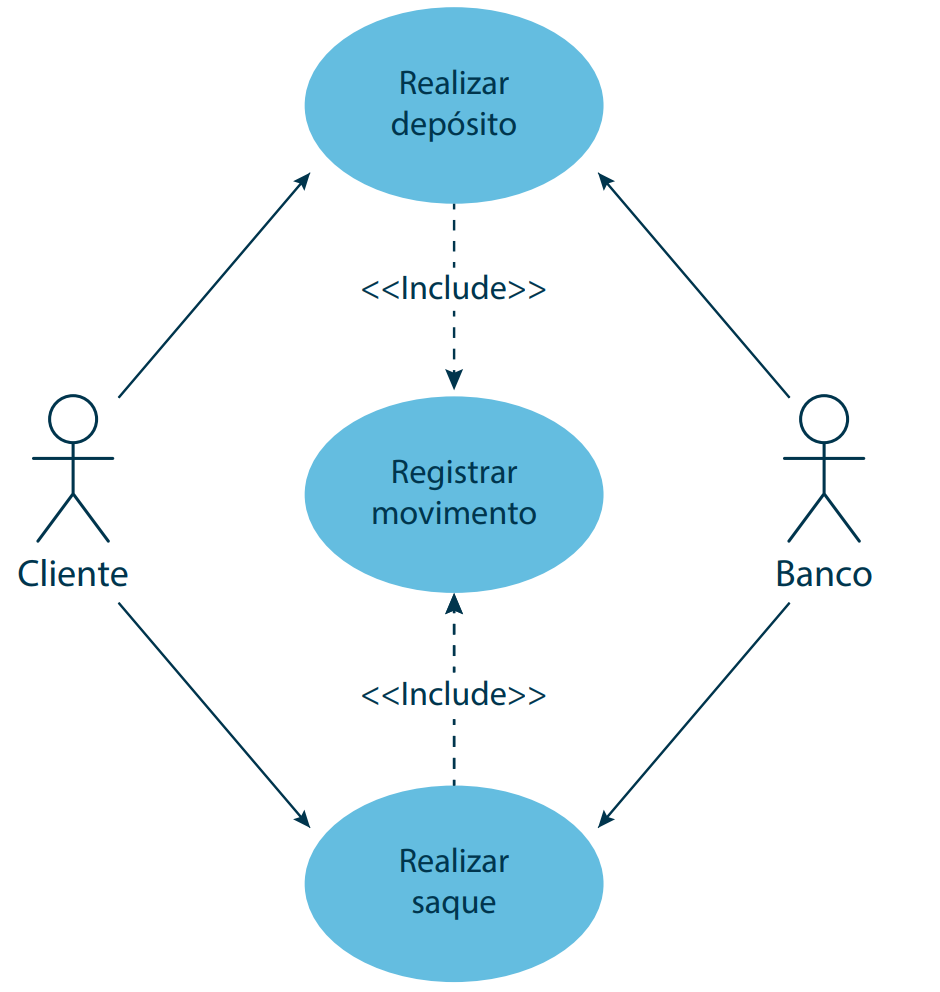

*Figura 11 — Inclusão de caso de uso.*

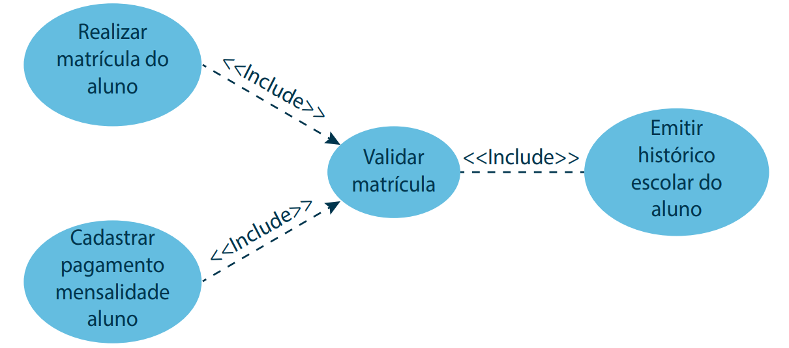

*Figura 12 — Um caso de uso incluído por vários casos de uso base.*

> **Observação sobre a Figura 12:** a linha entre "Emitir histórico escolar do aluno" e "Validar matrícula" está sem a ponta de seta — ela deveria apontar para **Validar matrícula**.

### 6.4 Extensão (`<<extend>>`)

- Possível **somente entre casos de uso**;
- Modela **comportamentos opcionais**, que ocorrem **somente se uma determinada condição for satisfeita**;
- Separa o comportamento **obrigatório** (caso base) do **opcional** (extensão).

**Notação:** linha **tracejada** com seta aberta, rotulada com `<<extend>>`. A seta **aponta para o caso de uso base** (o que é estendido) — o sentido é o **oposto** do `<<include>>`.

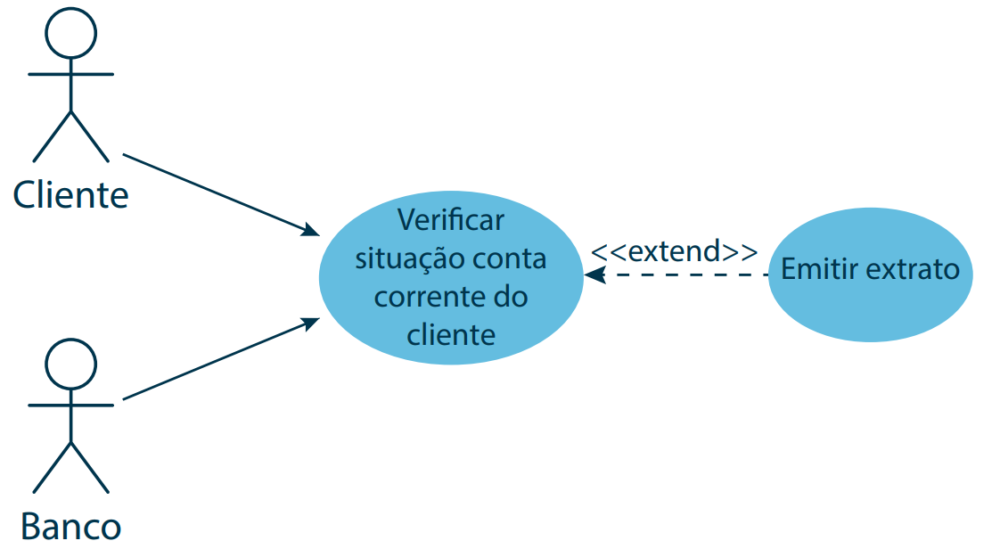

*Figura 13 — Extensão de caso de uso.*

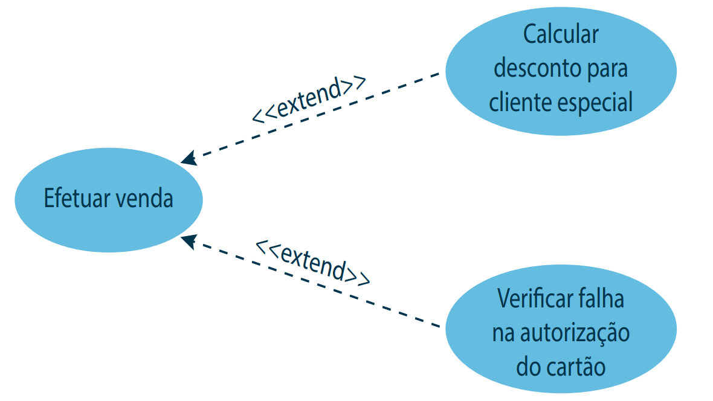

*Figura 14 — Representação de relacionamentos `<<extend>>`.*

> **Complemento — pontos de extensão e condição:** o caso base pode declarar **pontos de extensão** (*extension points*), indicando **onde** a extensão pode ocorrer, e o relacionamento pode trazer uma **condição** em uma nota, por exemplo: `{cliente.tipo = especial}`. Isso deixa claro **quando** o comportamento opcional é executado.

### 6.5 Include × Extend — como não confundir

| | `<<include>>` | `<<extend>>` |
|---|---|---|
| Execução | **Obrigatória** — sempre acontece | **Opcional** — só sob condição |
| Direção da seta | Do base **para o incluído** | Da extensão **para o base** |
| O caso base funciona sozinho? | Não, depende do incluído | Sim, a extensão é um acréscimo |
| Analogia | Chamada de sub-rotina | "Se… então" / *plug-in* |
| Pergunta-chave | "Isso sempre acontece e se repete em vários casos?" | "Isso só acontece às vezes?" |

---

## 7. Resumo dos relacionamentos

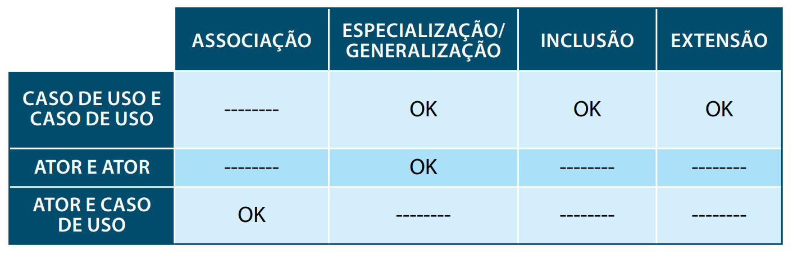

*Figura 15 — Relacionamentos entre casos de uso e atores.*

| | Associação | Generalização | Inclusão | Extensão |
|---|:---:|:---:|:---:|:---:|
| **Caso de uso e caso de uso** | — | ✔ | ✔ | ✔ |
| **Ator e ator** | — | ✔ | — | — |
| **Ator e caso de uso** | ✔ | — | — | — |

---

## 8. Boas práticas e erros comuns

**Boas práticas**

- Cada caso de uso deve entregar um **objetivo completo** para o ator;
- Use nomes no formato **verbo + complemento**, na linguagem do domínio do cliente;
- Desenhe a **fronteira do sistema** e mantenha os atores do lado de fora;
- Prefira **vários diagramas pequenos** (por módulo ou por ator) a um diagrama gigante;
- O diagrama é só o índice: **o valor está na descrição** de cada caso de uso.

**Erros comuns**

- Transformar o diagrama em **fluxograma** (encadear casos de uso como passos: "Logar → Escolher produto → Pagar");
- Abusar de `<<include>>` e `<<extend>>` para decompor funções — isso é **decomposição funcional**, não modelagem de casos de uso;
- Criar um caso de uso **"Fazer login"** incluído por todos os demais — autenticação costuma ser tratada como **pré-condição**;
- Colocar **requisitos não funcionais** ("Sistema deve ser rápido") como casos de uso;
- Ligar **ator a ator** por associação, ou ligar ator a caso de uso com `<<include>>`;
- Inverter o sentido das setas de `<<include>>` e `<<extend>>`.

> **Casos de uso × histórias de usuário:** em equipes ágeis, requisitos costumam ser escritos como **histórias de usuário** ("Como *vendedor*, quero *aplicar desconto a clientes especiais* para *fidelizá-los*"). As duas técnicas se complementam: o diagrama de casos de uso dá a **visão geral do escopo**, e as histórias detalham incrementos a serem entregues em cada *sprint*.

---

## Referências

- BOOCH, G.; RUMBAUGH, J.; JACOBSON, I. **UML: guia do usuário**. 2. ed. Rio de Janeiro: Elsevier, 2012.
- COCKBURN, A. **Escrevendo casos de uso eficazes**: um guia prático para desenvolvedores de software. Porto Alegre: Bookman, 2005.
- ERICKSON, J.; SIAU, K. Can UML be simplified? Practitioner use of UML in separate domains. In: **EMMSAD**, 2007. p. 87-96.
- OBJECT MANAGEMENT GROUP. **OMG Unified Modeling Language (OMG UML), Version 2.5.1**. 2017. Disponível em: https://www.omg.org/spec/UML/2.5.1.
- OBJECT MANAGEMENT GROUP. **Object Management Group approves final adoption of the SysML v2 specification**. 21 jul. 2025. Disponível em: https://www.omg.org/news/releases/pr2025/07-21-25.htm.
- PRESSMAN, R. S.; MAXIM, B. R. **Engenharia de software**: uma abordagem profissional. 9. ed. Porto Alegre: AMGH, 2021.
- SOMMERVILLE, I. **Engenharia de software**. 10. ed. São Paulo: Pearson, 2018.
- STAIR, R. M.; REYNOLDS, G. W. **Princípios de sistemas de informação**. 11. ed. São Paulo: Cengage Learning, 2015.
- WAZLAWICK, R. S. **Análise e projeto de sistemas de informação orientados a objetos**. 2. ed. Rio de Janeiro: Elsevier, 2011. (Série SBC).
